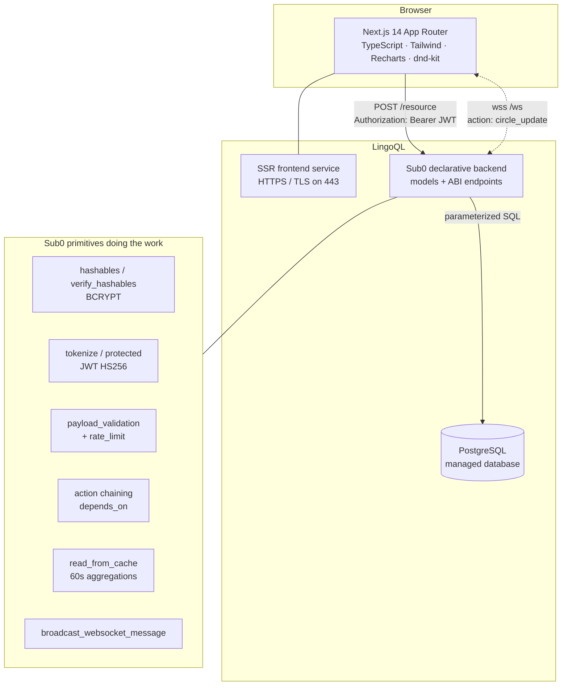

# CircleSafe

**Trustworthy Ajo. Every naira accounted for.**

CircleSafe is a transparent, append-only system of record for **rotating savings groups** —
*Ajo* / *Esusu* / *Susu* / *Tontine* — the informal circles that move enormous amounts of money
across West Africa every week with nothing but a notebook and trust.

Built for the **Zero to Query** hackathon. The backend is [designed for **Sub0**](backend/) as 23
declarative JSON resources — the running app uses a **self-hosted PostgreSQL runtime** implementing
the same contract (39 resources over 11 tables). Both speak the same wire format; switching
between them is two environment variables.

- **Live demo:** _to be added after deployment_
- **Demo video:** _to be added_
- **Source:** [github.com/akaheem/Circle-Safe](https://github.com/akaheem/Circle-Safe)_

---

## 1. The problem

A rotating savings circle works like this: ten traders each contribute ₦5,000 a week; each week
the ₦50,000 pot goes to one member, until everyone has taken a turn. It is one of the most
widely used savings instruments in West Africa — and it runs on paper.

That creates four failure modes people live with today:

| Problem | What it looks like in practice |
|---|---|
| **Fraud** | The collector disappears with the pot. There is no independent record to point to. |
| **Lost records** | The notebook is lost or a WhatsApp group is deleted; nobody can prove who paid. |
| **Disputes** | "I paid you last Tuesday." "You didn't." "Whose turn is it now?" |
| **No financial history** | Years of reliable payments produce zero credit signal a lender will accept. |

The tradition works. The bookkeeping doesn't.

## 2. The solution

CircleSafe keeps the tradition and replaces the notebook:

- **Append-only ledger.** Every action writes a row to `_activity` that is never updated or
  deleted. The audit trail *is* the data model, not a feature bolted on top.
- **Two-party confirmation.** A member records their contribution; a treasurer or the owner
  confirms it. Neither side can move money in the record alone.
- **Rules locked before the money moves.** Contribution amount, rhythm, grace period, late fee
  and the full payout order are set while the circle is `PENDING` and freeze the moment it goes
  `ACTIVE` — the backend enforces this in SQL, not just in the UI.
- **Trust Score.** Each member's reliability (confirmed contributions ÷ cycles elapsed) computed
  live from the ledger. This is the portable financial history the tradition never produced.
- **Circle Health.** One number for whether a circle is actually collecting what it's owed.
- **Live dashboard.** Every mutation broadcasts over WebSockets, so all members see the same
  numbers at the same time. Disputes need a shared source of truth, and this is it.

## 3. Architecture



**Request path (Sub0).** The browser POSTs to a Sub0 *resource*; Sub0 validates the payload,
verifies the JWT, rate-limits by IP, runs one or more chained SQL actionables, writes the audit
row, and broadcasts a socket message. There is no hand-written server code in the canonical design.

**Request path (self-hosted).** The same POST hits `app/api/[resource]/route.ts`, which dispatches
to the matching handler in `lib/server/resources.ts`. Every handler runs the same SQL, the same
validations and the same authorization checks — the only difference is the runtime: Node.js route
handlers instead of the Sub0 platform, Server-Sent Events instead of WebSockets. The mock mode
(`lib/api.ts` fallback) implements the same contract in memory so the UI is clickable without a
backend at all.

**Contribution lifecycle.**

```
member                treasurer/owner            owner              recipient
  │                         │                      │                    │
  ├─ record-contribution    │                      │                    │
  │   → _contributions      │                      │                    │
  │     (PENDING)           │                      │                    │
  │   → _activity           │                      │                    │
  │   → ws: circle_update   │                      │                    │
  │                         ├─ confirm-contribution│                    │
  │                         │   → CONFIRMED        │                    │
  │                         │   → _activity        │                    │
  │                         │   → ws               │                    │
  │                         │                      ├─ record-payout     │
  │                         │                      │   sums CONFIRMED   │
  │                         │                      │   for this cycle,  │
  │                         │                      │   pays position N, │
  │                         │                      │   cycle += 1       │
  │                         │                      │   (COMPLETED after │
  │                         │                      │    the last member)│
  │                         │                      │                    ├─ confirm-payout-received
  │                         │                      │                    │   → RECEIVED
```

## 4. Data model

**11 tables** actually run (the 6 core ones below, plus `_email_tokens`, `_invitations`,
`_join_requests`, `_emails` and `_revoked_tokens` for email verification, invitation lifecycle,
join-request workflow and JWT revocation). The canonical [Sub0 design](backend/) defines 6.

| Table | Purpose | Notes |
|---|---|---|
| `_users` | accounts | `email` unique + indexable; `password` BCRYPT-hashed, never returned |
| `_circles` | the savings group | `status` PENDING→ACTIVE→COMPLETED, `current_cycle`, `rules` JSON |
| `_memberships` | who is in a circle | `role` OWNER/TREASURER/MEMBER, `payout_position`, `status` |
| `_contributions` | money in | `cycle`, `amount` (NUMERIC, exact decimal), `status` PENDING/CONFIRMED |
| `_payouts` | money out | `cycle`, `recipient_id`, `status` SCHEDULED/PAID/RECEIVED |
| `_activity` | **append-only audit log** | INSERT only — never UPDATE, never DELETE |

Trust Score, Circle Health and Insights are **computed, not stored** — cached aggregation queries
over `_contributions` and `_memberships`. Nothing to drift, nothing to falsify.

## 5. How we used Sub0

Sub0 is declarative: you define models and endpoints as JSON, and the platform *is* the backend.
Everything below is a Sub0 primitive, not application code we wrote.

> **Note on the running app.** The table and endpoint counts in this section describe the
> [canonical Sub0 design](backend/) (6 models, 23 endpoint JSON files). The self-hosted runtime
> implements the same contract plus invitation lifecycle, join requests, email verification,
> discovery and an admin console — currently **39 resources over 11 tables**. The additional
> resources are a superset; nothing in the table is removed or changed.

| Sub0 primitive | Where CircleSafe uses it |
|---|---|
| **Models** (`JSON_OBJECT`, `foreign_key`, `indexable`) | 6 tables; `_circles.rules` is a `JSON_OBJECT`; every FK declared |
| **`hashables` / `verify_hashables`** | BCRYPT on `sign-up`, verification on `sign-in`; random salt in production |
| **`tokenize`** | JWT (HS256) issued on sign-up/sign-in, key from `$ENV.JWT_SECRET_KEY` |
| **`protected`** | Every non-public endpoint; ownership always comes from `$PROTECTED.id` |
| **`invalidate_tokenize`** | `logout` revokes the presented token |
| **`payload_validation`** | Types + length bounds on every endpoint that accepts input (`EMAIL`, `STRING`, `NUMBER`) |
| **`rate_limit`** | Auth, `create-circle`, `invite-member`, `record-contribution`, keyed on `$HEADER.ip` |
| **Action chaining** (`depends_on`) | `create-circle` → owner membership → audit row; `record-contribution` reads the cycle/amount, then inserts; `record-payout` computes the pot, inserts, advances the cycle, audits |
| **Caching** (`read_from_cache`, `cache_key`, `duration`) | 60s on `get-trust-score`, `get-circle-health`, `get-insights`; `get-dashboard` deliberately **uncached** so live numbers stay live |
| **`broadcast_websocket_message`** | On `start-circle`, `join-circle`, `record-contribution`, `confirm-contribution`, `record-payout`, `confirm-payout-received` |
| **`$GENERATOR.KSUID`** | All primary keys — sortable, collision-resistant, no sequence to leak |
| **Accessors** | `$ENV`, `$PAYLOAD`, `$HEADER.ip`, `$PROTECTED`, `$DATETIME`, `$GENERATOR` |
| **Injection prevention** | Every query parameterized; Sub0 blocks unsafe SQL before execution |

**23 endpoints**, all in `backend/endpoints/`:

| Group | Resources |
|---|---|
| Auth | `sign-up`, `sign-in`, `logout` |
| Circles | `create-circle`, `start-circle`, `list-my-circles`, `get-circle`, `update-circle-rules` |
| Members | `invite-member`, `join-circle`, `list-members`, `set-payout-order` |
| Contributions | `record-contribution`, `confirm-contribution`, `list-contributions` |
| Payouts | `record-payout`, `confirm-payout-received`, `list-payouts` |
| Dashboard | `get-dashboard`, `get-insights` |
| Scores | `get-trust-score`, `get-circle-health` |
| Activity | `list-activity` |

## 6. How we used LingoQL

- **Managed PostgreSQL** — provisioned on LingoQL; the password lives only as `$ENV.DB_PASSWORD`.
- **Sub0 backend service** — deployed on LingoQL with `JWT_SECRET_KEY` and
  `ALLOW_WEBSOCKET_CONNECTIONS=true` set as environment secrets.
- **SSR frontend** — LingoQL auto-detects Next.js, installs, builds and runs it; we read the
  injected `PORT` and bind `0.0.0.0`.
- **HTTPS/TLS** — terminated by LingoQL on 443, including the `wss://` socket upgrade.

The exact deploy runbook — provisioning, environment secrets, the port binding and the TLS
upgrade — is kept with the project and available on request.

> **Status note.** The hackathon's LingoQL/Sub0 credits were never issued to us (the credit cut-off
> turned out to be 21 July 2026 and wasn't announced), so there is no Sub0 instance to point at yet.
> The backend design in `backend/` is complete and unchanged; §11 covers how the same 23 resources
> run on ordinary PostgreSQL in the meantime.

## 7. Security

- Passwords BCRYPT-hashed by Sub0; never present in any `returnables`.
- Authorization derived from the **verified token claim** (`$PROTECTED.id`), never from a payload
  field a client could forge.
- **RBAC in SQL.** Confirming a contribution requires an `EXISTS` check that the caller is
  `OWNER` or `TREASURER` *of that circle*; recording a payout requires circle ownership; reads
  require membership. A wrong role doesn't get a filtered view — it gets zero rows.
- Rules and payout order are only writable while `status = 'PENDING'`, enforced in the `WHERE`
  clause of the update itself.
- Rate limiting on auth and every high-frequency mutation.
- Secrets exclusively via `$ENV`; none committed to this repo.
- Tokens travel in the `Authorization` header (not cookies), so CSRF does not apply; protected
  sockets pass the JWT as the `x-access-token` subprotocol.
- `_activity` is INSERT-only by construction — no endpoint can update or delete it.

## 8. Repository layout

```
backend/
  models/            6 Sub0 model files (filename = table name)
  endpoints/         23 Sub0 ABI endpoint files, grouped by domain
    README.md        paste order, conventions, caveats to verify on the live instance
    realtime/        how the WebSocket broadcasts fit together
frontend/
  app/api/           self-hosted runtime: one dispatcher for all 23 resources + an SSE stream
  lib/server/        schema, handlers, auth, validation, rate limit, cache (see §11)
  scripts/           db-init + end-to-end smoke test
frontend-design-reference/   palette exploration + the original Lightfall hero
docs/                documentation deck + project description
```

## 9. Run it locally

```bash
cd frontend
npm install
npm run dev          # http://localhost:3000
```

With nothing configured, the app runs in **demo mode** against an in-memory mock of every resource —
the whole flow (invite → drag the payout order → start → contribute → confirm → payout → confirm
receipt) is clickable without a backend. To use a real one, set the variables in
[`frontend/.env.example`](./frontend/.env.example): a Postgres connection for the self-hosted
runtime (§11), or `NEXT_PUBLIC_API_URL` for a Sub0 instance.

## 10. Stack

**Frontend:** Next.js 16 (App Router) · React 19 · TypeScript · Tailwind CSS · Recharts · dnd-kit ·
framer-motion · ogl (WebGL hero) · lucide-react
**Backend:** Sub0 (declarative JSON models + ABI endpoints) — zero hand-written server code
**Database:** PostgreSQL (managed by LingoQL)
**Hosting:** LingoQL (frontend + backend + database + TLS)
**Fallback runtime:** Next.js route handlers + `pg` + `bcryptjs` + `jsonwebtoken` (§11)

## 11. Running without Sub0

Since we have no Sub0 instance, the app also ships a **self-hosted runtime**: the same 23 resources,
executing the same SQL, against any PostgreSQL. The Sub0 definitions in `backend/` are untouched —
this is a second executor for one contract, not a rewrite.

```bash
cd frontend
export DATABASE_URL="postgres://…"      # any Postgres: Neon / Supabase / Railway free tier
export JWT_SECRET_KEY="$(node -e 'console.log(require("crypto").randomBytes(48).toString("base64url"))')"
export NEXT_PUBLIC_LOCAL_API=true

npm run db:init    # apply the schema
npm run dev        # then, in another terminal:
npm run smoke      # full lifecycle + authorization tests
```

Each Sub0 primitive has a direct counterpart — `payload_validation` → `lib/server/validate.ts`,
`hashables` → bcrypt, `protected` → verified JWT claims, `depends_on` → one transaction,
`read_from_cache` → a 60s TTL cache, `broadcast_websocket_message` → SSE. The mapping table, the
deploy steps, and an honest verification status are documented alongside the runtime itself in
`frontend/lib/server/`.

Building it also surfaced two gaps in the Sub0 definitions (an uncapped `invite-member`, and cached
aggregations keyed without the caller) — both fixed in the self-hosted runtime and logged in
`backend/endpoints/README.md` to backport.

## 12. Future work

Deliberately out of scope for this build, in rough priority order:

1. **Reminders** — Sub0 cron + queues for "contribution due in 2 days" nudges.
2. **SMS / WhatsApp channels** — most Ajo members live in chat, not in dashboards.
3. **Payment rails** — connect a provider so contributions settle in-app instead of being
   recorded after the fact.
4. **Portable trust score** — export a signed reliability history a lender can verify.
5. **Receipt uploads** — Sub0 `UPLOAD` actionables for transfer screenshots as secondary evidence.
6. **Multi-currency circles** and diaspora contributions.

## 13. Credits

Design language is *inspired by* a Bootstrap landing template (UIdeck "Bliss") but shares no code,
CSS, assets or fonts with it — the UI is an original rebuild in Next.js + Tailwind with our own
"Savanna Trust" palette (emerald / mint / gold on deep forest) and Space Grotesk + Inter.
The WebGL hero is our own `Lightfall` component, recolored to the palette.
